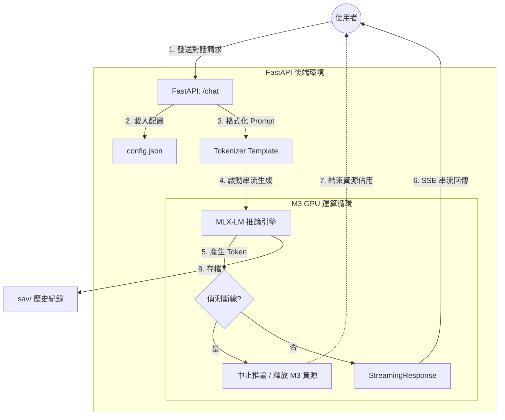

# Castor-MLX (MLX-Project)
本專案是一個專為 Apple Silicon (M3) 優化的本地大型語言模型（LLM）對話環境。採用 MLX 框架實現硬體加速，並具備 LaTeX 數學公式渲染與自動化對話存檔功能。

本專案捨棄了冗長的開發對話紀錄，僅保留經過實機調試（Debugging）後的架構精華。這是一個「以人為導向、AI 為工具」的快速原型實踐，目標是達成在 M3 晶片上最純粹的 LLM 使用體驗。

核心技術架構

後端 (Backend): FastAPI (Python 3.12)，負責模型載入、串流生成（Stream Generation）與 JSON 檔案管理。

模型層 (Model): Qwen3-4B-Instruct-2507-4bit (MLX 量化版本)。

前端 (Frontend): 原生 JavaScript + Marked.js + MathJax，支援複雜數學公式與程式碼高亮。

環境管理: 使用 uv 工具進行相依性鎖定（uv.lock）。

技術實作特色
高效推理循環 (Efficient Inference Loop)：本專案直接調用 mlx_lm.stream_generate，針對 Apple Silicon 的統一記憶體架構進行優化，確保在 M3 晶片上實現低延遲產出。

資源防禦機制 (Resource Guard)：在 event_generator 中嵌入了 request.is_disconnected() 檢查。這確保了當前端使用者關閉分頁或中斷連線時，後端會立即強行停止 GPU 運算，精確管理本地端的電量與算力資源。

輕量化持久層 (Lightweight Persistence)：捨棄傳統資料庫，直接透過 json 序列化將對話紀錄保存於 sav/ 目錄中，並在存檔前自動過濾 system_prompt 以確保前端顯示的一致性。

快速啟動
1. 環境準備
確保您的設備為 MacBook Air M3 16G以上，且已安裝 uv 與 brew。

Bash
# 安裝 Python 依賴
uv sync
2. 執行應用
Bash
# 啟動 FastAPI 服務
uv run main.py
啟動後，請使用 Brave 瀏覽器訪問 http://127.0.0.1:8000。

使用手冊與操作流程
提示詞 (Prompt) 策略
系統預設配置於 config.json。針對 4B 模型，本環境採用「技術解構法」：

數學運算: 自動使用 LaTeX $$ 包裹。

程式撰寫: 採用 Markdown 代碼塊，嚴禁混用 LaTeX。

對話管理
自動存檔: 所有對話將即時序列化並儲存於 /sav 目錄下。

系統設定: 可透過前端「⚙️ 設定」介面動時調整 system_prompt 與 max_tokens。

未來維護與核心架構修改
若需對專案進行升級或遷移，請參考以下核心模組：

1. 替換模型
修改 main.py 中的 MODEL_PATH 變數。請確保新模型為 MLX 格式且擁有完整的 tokenizer_config.json 與 snapshots 架構。

2. 調整前端渲染
index.html 中的 window.MathJax 與 marked.setOptions 決定了內容呈現方式。若需支援更複雜的 Markdown 語法（如圖表），需於此處擴充渲染器。

3. API 擴展
核心端點: /chat 負責處理 SSE (Server-Sent Events) 串流。

狀態控制: setLock(state) 函式負責在模型推理期間鎖定輸入介面，防止併發請求崩潰。

目錄規範
/models: 模型權重與配置（巨量資料，建議使用 ln -s 連結）。

/sav: 使用者歷史對話紀錄。

config.json: 系統運行時參數。

## ⚖️ 授權與智財聲明 (License & IP)
- **Code:** 採用 MIT License。
- [cite_start]**Author:** Michael (負責架構設計、資源管理邏輯、M3 硬體調試)。 [cite: 2]
- **AI Statement:** 核心實作由 AI (Gemini) 協助生成，但所有關鍵邏輯與安全性修正均經過人工審核與實機驗證。

